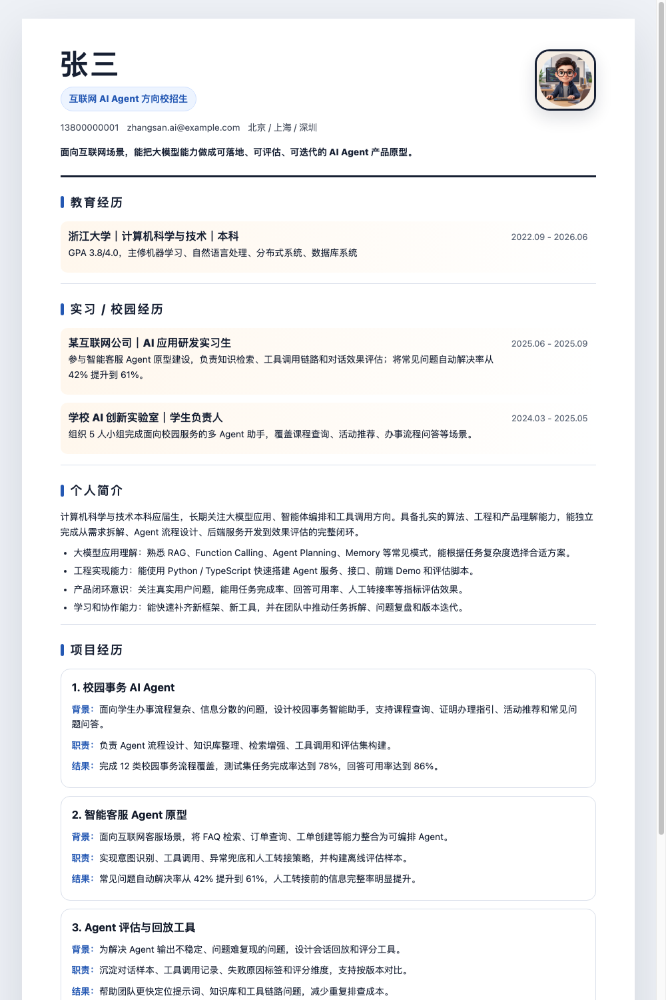
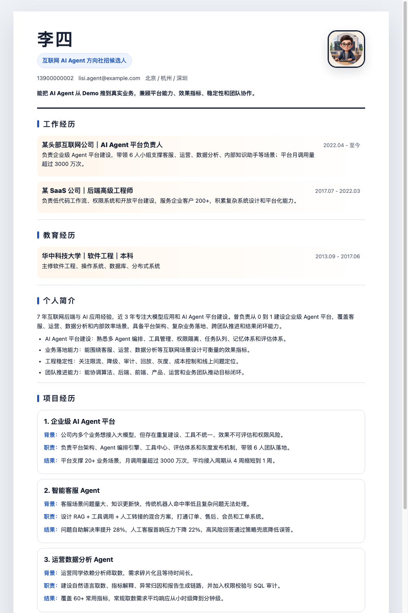

# Zoe Skills

## 当前 skills

| Skill | 路径 | 适合做什么 | 常见用法 |
| --- | --- | --- | --- |
| `resume-generator` | `resume-generator-skill/` | 生成、改写、优化、排版简历；支持完整版简历、精华亮点版、HTML 预览，并在用户确认后导出 PDF。 | `$resume-generator 根据我的经历生成一份完整版简历` |

## resume-generator

### 安装方式

```bash
npx skills add Zoe936/zoe-skills --skill resume-generator
```

### 使用方式

安装后，在对话中用 `$resume-generator` 调用：

```text
$resume-generator 帮我生成一份社招 AI Agent 开发工程师简历
```

也可以直接把个人信息一次性给全：

```text
$resume-generator 生成我的简历。
我叫王五，目标岗位是 AI Agent 开发工程师，上海，5 年经验。
不放照片。
联系方式是 13900000002，wangwu.agent@example.com。
2019.07 - 至今在某头部互联网公司做 AI Agent 平台负责人。
项目是企业级 AI Agent 平台，负责平台架构、Agent 编排引擎、工具中心、评估体系和灰度发布机制。
带领 6 人小组，平台月调用量超过 3000 万次。
教育经历是华中科技大学软件工程本科。
技术栈是 Python、TypeScript、React、Node.js。
我要完整版，风格黑白专业。
```

### 示例说明

仓库里已经放了可直接查看的示例文件，路径在 `resume-generator-skill/examples/`。

| 示例 | 适合参考什么 | 预览图 | PDF |
| --- | --- | --- | --- |
| 张三 - AI Agent 校招生完整版简历 | 校招生/实习生简历的内容组织、版式和视觉风格 |  | [查看 PDF](resume-generator-skill/examples/张三-AI-Agent校招生-完整版简历.pdf) |
| 李四 - AI Agent 社招完整版简历 | 社招 AI Agent 开发/平台负责人简历的内容组织、版式和视觉风格 |  | [查看 PDF](resume-generator-skill/examples/李四-AI-Agent社招-完整版简历.pdf) |

如果想看精华亮点版，也可以打开同一目录下的手机版和 PC 版示例

### 需要准备的信息

`resume-generator` 会先收集关键信息。信息不够时，它会继续追问，不会直接编造简历内容。

建议提前准备：

- 姓名、联系方式、城市
- 是否使用照片；如果使用，提供照片文件路径
- 目标岗位和候选人类型
- 教育经历
- 工作经历
- 至少一个代表项目
- 技术栈
- 希望输出完整版、精华亮点版，或两者都要
- UI 风格偏好，例如黑白专业、Apple 极简、科技作品集

### 输出流程

1. 先生成 Markdown 内容。
2. 内容方向确认后生成 HTML 预览。
3. 用户确认 HTML 后再导出 PDF。
4. PDF 导出后检查页面、文字、图片和空白情况。
